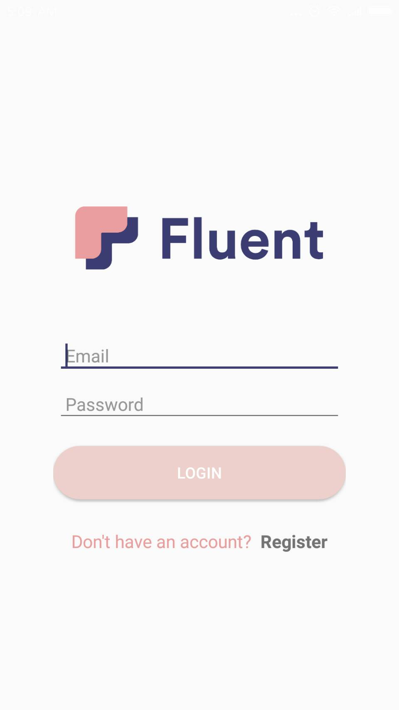

# Fluent-Android

  

## Introduction
Android part of Fluent. Simply import the project on android studio and run it.

## Info
Currently it is running on WebRTC only, will reconfigure it to support PeerJS as well so that it can make voice calls to the backend server.
Will also add Cordova, ionic and crosswalk to this project.

## Display

  

